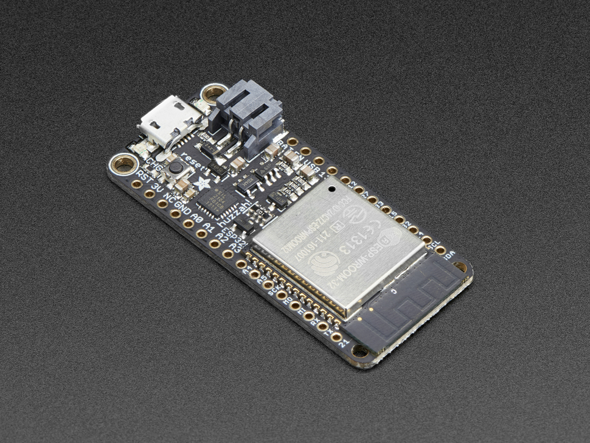

# Project DAGR Outline

## Outline

The idea behind this Project DAGR is to create a decentralized offline text based chat with Long Range (LoRa) Radio. The project will use a mobile phone connected to a LoRa enabled device via Bluetooth or Wi-Fi to communicate with this network. The phone will have an application that we develop to accomplish this. The hardware will also have custom software to handle sending these messages.


## Hardware 



- [Adafruit HUZZAH32](https://www.adafruit.com/product/3405) - $20
- [Adafruit LoRa Radio FeatherWing](https://www.adafruit.com/product/3231) - $20
- 3d Printed case
- Battery (size may vary)

Approximate hardware cost per node: $40-$45


The hardware for this project, which will be known as DAGRs, will be comprised of an Adafruit HUZZAH32. This board has built in WIFI and Bluetooth due to the ESP32 chip. It also have a built in battery power and charging circuit. The board will also be equipped with the Adafruit LoRa Radio FeatherWing. This will add the LoRa transceiver. The benefit of the Adafruit Feather platform is that there are many sensors and additional features that can be added if the need arises. These boards are also low powered so they will be able to have a long battery life.

## Software

### Mobile Application

This application will be written in Flutter/Dart since the goal is to have this be a cross-platform application. Flutter is a UI toolkit to help create mobile, web, and desktop application rapidly. Flutter is written in Dart and has make native widgets that allows for faster rendering than other UI toolkits. This application will be a text based messenger that will connect to these LoRa nodes via Bluetooth to send over the LoRa network.  This application will handle the compression and encryption of the messages to reduce the processing needed on the LoRa hardware. 

#### Key Features:

- Text Based Chat
- Encryption of messages using AES 128 (subject to change)
- Compression of Messages
- Delivery receipts

#### Extra Features

These are features that may be added if time allows

- Online/offline status
- Group messages
- Images

### DAGR Software

This application will be run on the LoRa hardware and will receive messages via Bluetooth and send the messages out via LoRa. This will also receive messages from the LoRa interface and send them to the mobile application via Bluetooth. This application will be written in C++ or MicroPython/CircuitPython. 

#### Key Features

- Message passing
- Message Filtering (only receive messages that are meant for the user)
- Message retrying

#### Extra Features

- Ad-hoc/Mesh network
- User location tracking (via gps or Triangulation)
- Multiple users per node

## Minimum Viable Product (MVP)


The minimum Viable Product/proof of concept will be having the DAGRs be able to send messages back and forth using LoRa. These messages will be preset/hard coded. From there the mobile app will be added as well as some more advanced features.

### Installing MVP

1. install the radiohead library in the arduino libraries folder
2. upload sketch to adafruit feather


### Generating ProtoBuf

```
cd bin/nanopb/generator
./protoc '--nanopb_out=../../../lib/proto -f ../../../proto/dagr.options:../../../lib/proto' --proto_path=../../../proto ..\..\..\proto\dagr.proto
```
